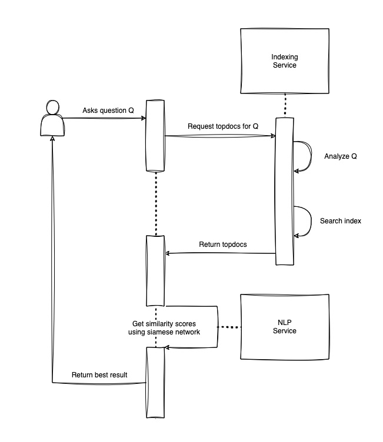

# Information Retrieval Project
## Quick description
A user-friendly and docker reproducible insurance question and answer chatbot.

We have created this project as a part of course Information Retrieval at the University of Novi Sad, Faculty of Sciences.

The aim of the project was to create an application which asks user to input a question related to insurance, and then processes this
question through two layers. Based on the processing, the user is then given the best answer available from a dataset which contains
predefined question and answer pairs.

## Components and tech stack
Chatbot contains 3 software components:

1. Web UI - Landing page - html, css and JavaScript
2. Indexing service - Apache Lucene - Java
3. Natural language processing service - Siamese neural network for text processing - Python

## Design

