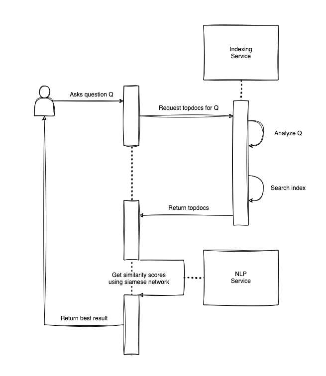

# Information Retrieval Project
## Quick description
A user-friendly and docker reproducible insurance question and answer chatbot.

We have created this project as a part of Information Retrieval course at the University of Novi Sad, Faculty of Sciences.

The aim of the project was to create an application which asks the user to input a question related to insurance, and then it processes this
question through two layers. Based on the processing performed by the application, the user is then given the best available answer from a dataset 
which contains predefined question and answer pairs.

## Components and tech stack
Chatbot contains 3 software components:

1. Web UI - Landing page - html, css and JavaScript
2. Indexing service - First layer of processing - Apache Lucene and Java Spring Boot
3. Natural language processing service - Second layer of processing using Siamese neural network - TensorFlow Keras / Torchtext for training and FastAPI for API

## Design


## How to run the project
First clone the project:

```
  git clone git@github.com:mihailosu/pmf-ir-qa-system.git
```

Use docker-compose to build and run the project:

```
  docker-compose build
  docker-compose up
```

Open the app in your browser:

```
  http://localhost:3000/
```

Note that glove 6B first needs to be loaded into memory for the NLP service to work. You can check the status of glove download in docker dekstop logs. After glove 6B has been downloaded, NLP service will start. You can then use the app at http://localhost:3000/.
